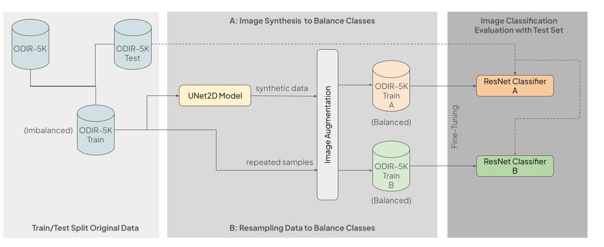

# Addressing Class Imbalance in Classification Models: A Comparative Study of Synthetic Image Generation and Resampling Techniques

Webpage: https://expo.baulab.info/2024-Spring/rachaeltc/

In “LesionAid: Vision Transformers-based Skin Lesion Generation and Classification,” Krishna et al. propose a system containing a deep learning architecture that can be used for early detection of skin lesions through image classification. They identify that there is a significant discrepancy in the number of samples for each label in their multi-class dataset, so to address this issue of class imbalance, they design a system that uses synthetic images from ViTGANs trained on original image data and adopts this data as a part of their Lesion database. This database is eventually used for lesion classification. 

**We aim to investigate the effectiveness of the paper’s proposed method of using synthetic images to solve the issue of class imbalance, as opposed to the more basic, and less costly, method of resampling**, in which samples from minority classes are repeated to fill the gaps. Our data consists of images of ocular diseases labeled with one of four classes, each representing a different ocular condition. Similar to the original paper, we aim to generate synthetic and augmented images to address class imbalance. We follow a similar process to a paper but with different approaches at each step. Specifically, we use a diffusion model for image generation instead of a ViTGAN, and for image classification, we use a pretrained ResNet on which we fine-tune our ocular disease data. 

Our Implementation Preview:

